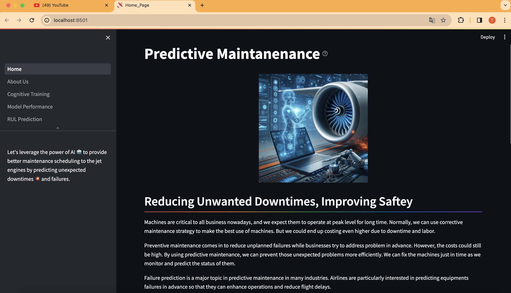
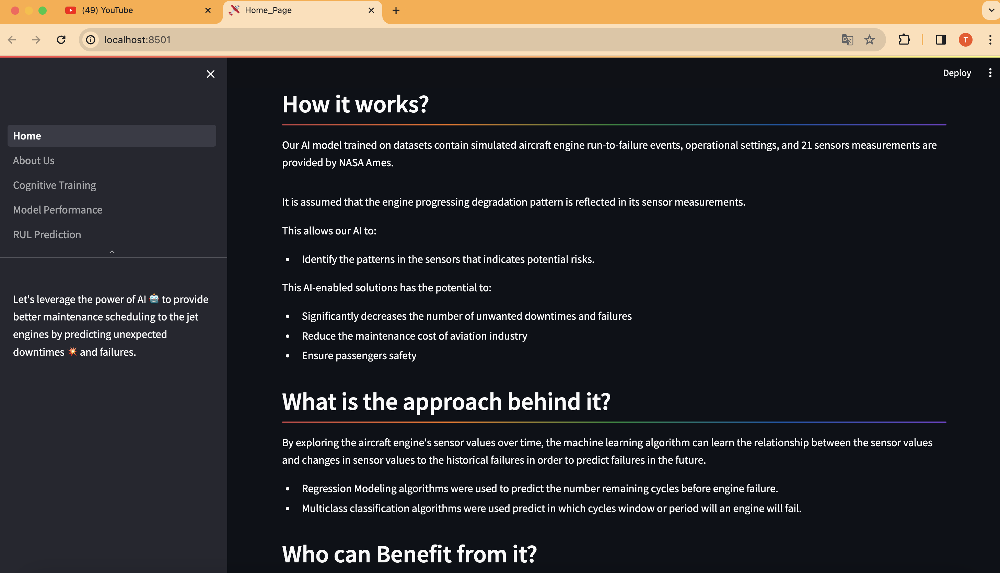
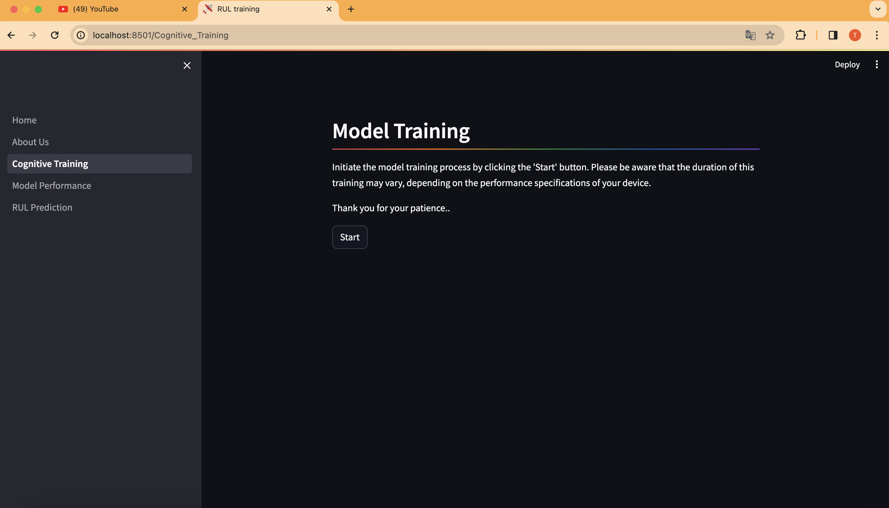
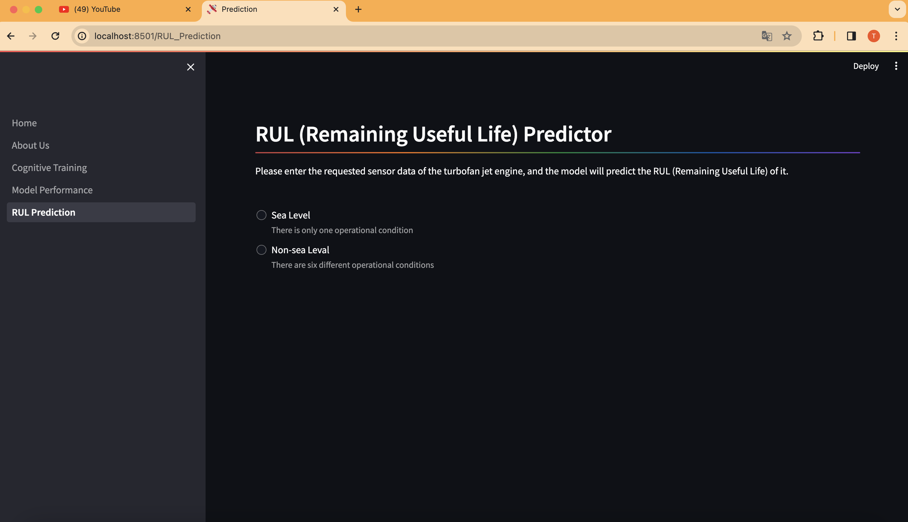
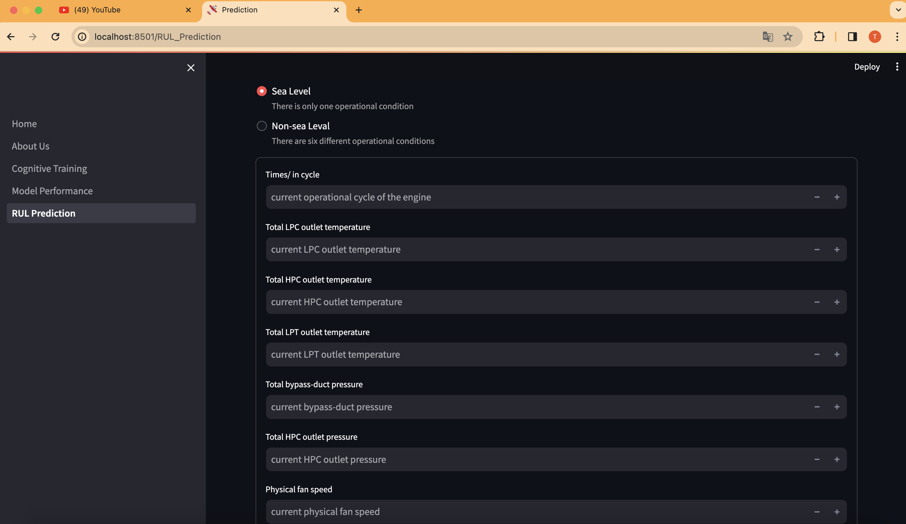
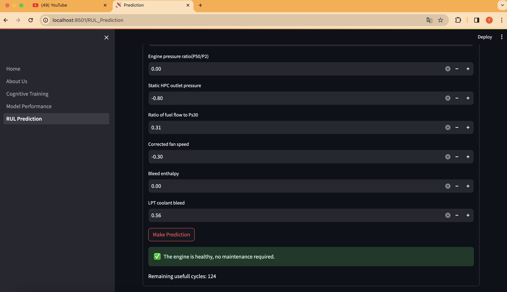
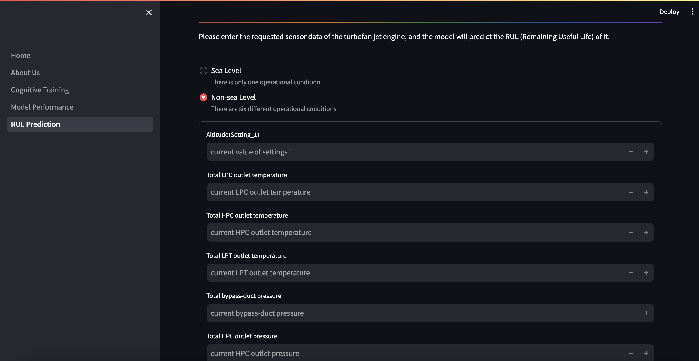
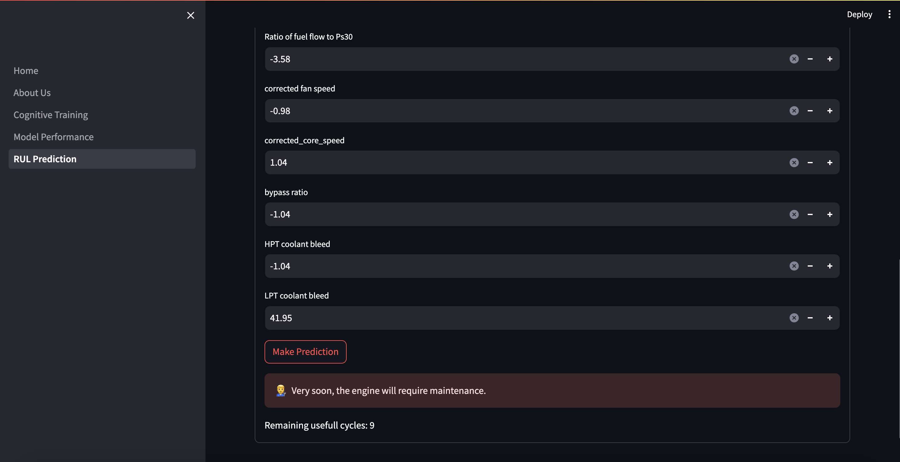

## Predictive Maintenance of Jet Engines
Machines are critical to all business nowadays, and we expect them to operate at peak level for long time. Normally, we can use corrective maintenance strategy to make the best use of machines. 
But we could end up costing even higher due to downtime and labor. 

Preventive maintenance comes in to reduce unplanned failures while businesses try to address problem in advance. However, the costs could still be high. By using predictive maintenance, we can prevent those unexpected problems more efficiently. We can fix the machines just in time as we monitor and predict the status of them.
        
Failure prediction is a major topic in predictive maintenance in many industries. Airlines are particularly interested in predicting equipments failures in advance so that they can enhance operations and reduce flight delays.

<details open="open">
  <summary>Table of Contents</summary>
  <ol>
    <li>
      <a href="#Approach">Approach</a>
    </li>
    <li>
      <a href="#Features">Features</a>
    </li>
    <li>
      <a href="#Technologies">Technologies</a>
    </li>
    <li>
      <a href="#Prototype">Protoype</a>
    </li>
    <li>
	    <a href = "#How-to-Start-Project">How to Start Project</a>
    </li>
    <li>
	    <a href = "#Contact-Us">Contact Us</a>
    </li>
    <li>
	    <a href = "#License">License</a>
    </li>
  </ol>
</details>

## Approach
By exploring the aircraft engine's sensor values over time, the machine learning algorithm can learn the relationship between the sensor values and changes in sensor values to the historical failures in order to predict failures in the future.
- Regression Modeling algorithms were used to predict the number remaining cycles before engine failure.
- Multiclass classification algorithms were used predict in which cycles window or period will an engine will fail.


## Features
This AI-enabled solutions has the potential to:
- Significantly decreases the number of unwanted downtimes and failures
- Reduce the maintenance cost of aviation industry
- Ensure passengers safety

## Technologies
- Python
- Streamlit
- Catboost
- Matplotlib

## Prototype:

<div style="display:flex; flex-wrap:wrap; gap:2%; justify-content:center;">








</div>

## How to Start Project

Follow these steps to get started with the project:

1. **Clone the Repository:**
   ```bash
   git clone <repository_link>
   ```
2. **Install Anaconda:**
   
   Make sure you have Anaconda installed on your system. If not, you can download and install it from the official website: https://www.anaconda.com/download/
   
4. **Create a Virtual Environment:**
   
   Create a new virtual environment using Python 3.9.6:

   ```bash
   conda create --name your_env_name python=3.9.6 -y
   ```
   Replace your_env_name with the desired name for your virtual environment.
   
   Activate the newly created environment:
   ```bash
   conda activate your_env_name
   ```
5. **Install Dependencies:**
   
   Install the project dependencies by running:
   ```bash
   pip install -r requirements.txt
   ```
   This command will install all the required packages listed in the requirements.txt file.

7. **Run the Streamlit App:**
   ```bash
   streamlit run Home.py
   ```
   This command will start the Streamlit app.

## Contact Us

To learn more about our system and how it can help to reduce cost, please reach out:

📧 tapankheni10304@gmail.com

## License

This project is licensed under the MIT License - see the [LICENSE](LICENSE) file for details.
